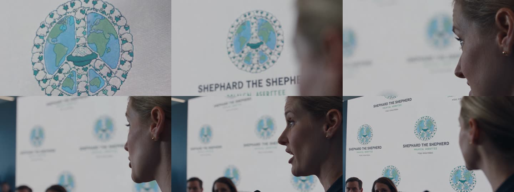

<div align="center">

# 🎬 Cinematic Image Prompt Skill

**把一句画面想法，变成主体清楚、空间稳定、光线可信、色彩干净的电影感生图提示词。**

[简体中文](README.md) · [English](README_EN.md)

[](https://agentskills.io/)
[](https://github.com/openai/codex)
[](https://docs.anthropic.com/en/docs/claude-code)
[](https://qwenlm.github.io/qwen-code-docs/zh/users/features/skills/)
[](CONTRIBUTING.md)

[快速开始](#30-秒开始) · [真实案例](#真实案例) · [多-agent-安装](docs/agent-installation.md) · [方法资料库](#方法资料库) · [参与贡献](CONTRIBUTING.md)

</div>

---

这不是“高级词汇堆砌器”。它先解决主体数量、属性绑定、左右前后、遮挡、视觉中心和光源逻辑，再决定机位、景别、视场、景深、色彩、影调与材质，重点减少漏主体、串颜色、错位置、灰图、脏色、塑料皮肤和过度锐化。

## 目录

- [为什么需要它](#为什么需要它)
- [30 秒开始](#30-秒开始)
- [工作方式](#工作方式)
- [适用方向](#适用方向)
- [真实案例](#真实案例)
- [多 Agent 安装](#多-agent-安装)
- [方法资料库](#方法资料库)
- [质量审核](#质量审核)
- [项目结构](#项目结构)

## 为什么需要它

| 常见问题 | 这个 Skill 的处理方式 |
| --- | --- |
| “电影感、8K、杰作”很多，画面仍然空泛 | 先确定叙事瞬间、唯一视觉中心和可见动作 |
| 多人、多物体经常漏掉或串色 | 逐个绑定数量、身份、属性、位置和动作 |
| 焦段、景别、透视互相打架 | 区分摄影机位置、拍摄距离、视场和透视结果 |
| 光线漂亮但没有来源 | 每束关键光都说明来源、方向、软硬和作用 |
| 画面灰、脏、过锐或塑料感 | 分开控制色彩、影调、材质、颗粒和锐度 |
| 负面词写成几十项通用黑名单 | 只约束当前画面最可能发生的错误 |

## 30 秒开始

```text
使用 $cinematic-image-prompt，把“一个女孩在雨夜公交站等人”改写成真人电影感生图提示词。
```

Skill 默认只交付提示词。只有用户明确说“生成图片”“直接出图”或“渲染”时，才进入图片生成流程。


## 工作方式

1. 锁定不可改变的信息与唯一视觉中心。
2. 绑定每个主体的数量、属性、动作和空间位置。
3. 先规划前中后景、遮挡和留白，再选择机位与景别。
4. 设计有动机的光源、色彩关系、影调和材质。
5. 生成少量、针对当前画面的负向约束。
6. 按 100 分审核表复核；未达 90 分或触发硬门槛时先改写。

## 适用方向

| 方向 | 优先控制 |
| --- | --- |
| 真人电影感 / 纪实摄影 | 可信皮肤、真实光源、摄影机位置、颗粒与高光过渡 |
| 动漫插画 | 线条、形状、色块、透视、笔触或赛璐璐层次 |
| 电商产品 | 商品形状、包装文字、材质反射、干净背景和可控阴影 |
| 建筑 / 室内 | 空间尺度、垂直线、消失点、材质与采光方向 |
| 概念场景 | 世界规则、尺度参照、空间层次、天气与大形关系 |

## 真实案例

### 女发言人 / SHEPHARD THE SHEPHERD

用户提供的 15 秒实测成片与此前 DiDi_OK“女发言人”案例一致。仓库将它作为“提示词视觉意图 → 成片关键帧 → 可复用静帧提示词”的验证案例，不重复计为新的案例类型。



[查看完整案例拆解](cases/shepherd-spokesperson.md)

## 多 Agent 安装

这个仓库以开放的 `SKILL.md` 目录结构为唯一真源，并提供两层兼容：

- **原生 `SKILL.md`**：Codex、Claude Code、CodeBuddy、Qwen Code、Qoder。
- **平台转换适配**：WorkBuddy 当前官方自定义 Skill 使用 `skill.yml`，由 WorkBuddy 根据本仓库生成并安装。
- **系统提示词兼容**：暂未公开第三方 `SKILL.md` 导入规范的平台，例如豆包，以及只支持自定义指令/知识库的 Agent。

最通用的社区安装方式：

```bash
npx skills add wusuyee-beep/cinematic-image-prompt-skill -g
```

不同平台的官方目录、ZIP 导入方法、验证命令与兼容级别见 [多 Agent 安装与兼容矩阵](docs/agent-installation.md)。不支持原生 Skill 的平台使用 [自包含系统提示词适配版](adapters/system-prompt.zh-CN.md)。

## 方法资料库

| 文件 | 解决的问题 |
| --- | --- |
| [`prompt-architecture.md`](references/prompt-architecture.md) | 如何从意图组织成可执行提示词 |
| [`visual-language.md`](references/visual-language.md) | 机位、景别、焦段、透视、光线与色彩如何正确使用 |
| [`model-failures.md`](references/model-failures.md) | 多主体、文字、参考图和系列一致性的常见失败 |
| [`examples.md`](references/examples.md) | 可复制的输出密度与结构示例 |
| [`review-rubric.md`](references/review-rubric.md) | 交付前 100 分审核与硬门槛 |
| [`sources.md`](references/sources.md) | 教材、官方文档与论文来源 |

## 质量审核

| 模块 | 分值 |
| --- | ---: |
| 意图与视觉中心 | 15 |
| 主体、计数与属性绑定 | 20 |
| 空间布局与构图 | 20 |
| 机位、视场、焦点与景深 | 15 |
| 光线、色彩与影调 | 15 |
| 材质、文字与参考图职责 | 10 |
| 负向约束与可执行性 | 5 |

任何主体数量、属性归属、机位空间或光源逻辑的硬冲突都会直接退回改写。

## 项目结构

```text
cinematic-image-prompt-skill/
├── SKILL.md
├── agents/openai.yaml
├── adapters/system-prompt.zh-CN.md
├── cases/
├── docs/agent-installation.md
├── evals/evals.json
└── references/
```

## 方法依据

摄影与视觉语言部分参考 Blain Brown、Bruce Block、Joseph V. Mascelli 与 Kodak；生成方法参考 Google Imagen 官方指南，以及 DOCCI、LayoutGPT、Attend-and-Excite 关于详细描述、布局规划、主体遗漏与属性绑定的研究。完整来源见 [`references/sources.md`](references/sources.md)。

## 相关项目

- [Seedance 2.5 电影感视频提示词 Skill](https://github.com/wusuyee-beep/seedance-2.5-cinematic-prompt-skill)：以 DiDi_OK 六个 Case 为主要规则来源的视频提示词项目。

如果它帮你稳定产出了更好的画面，欢迎 Star、提交真实 Case，或把一次失败生成整理成可复现问题。
